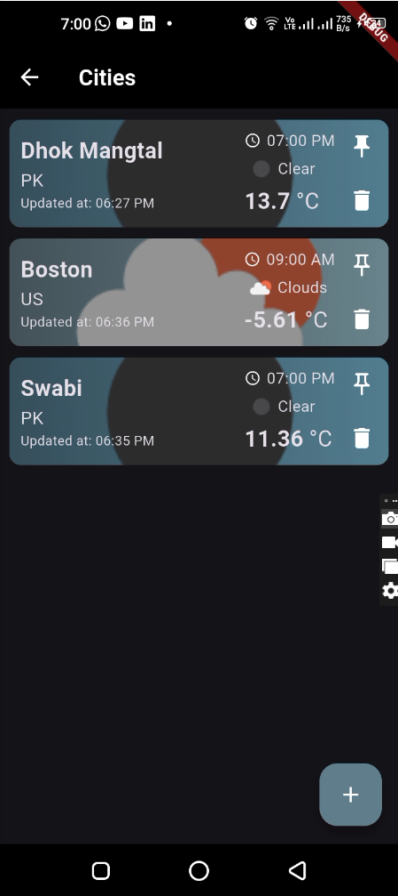
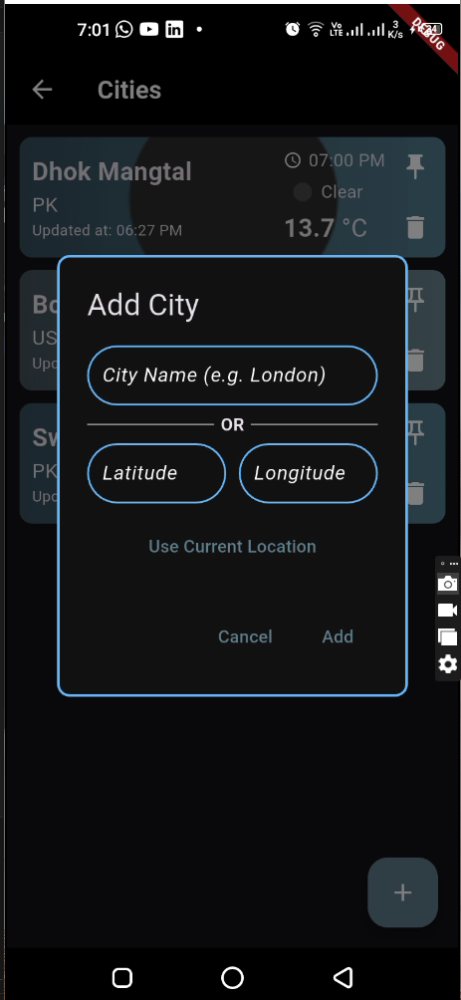
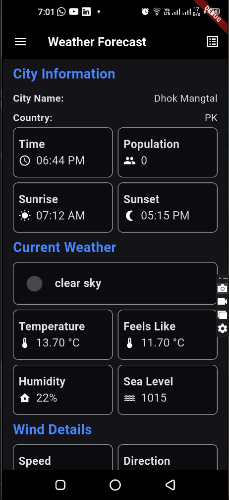
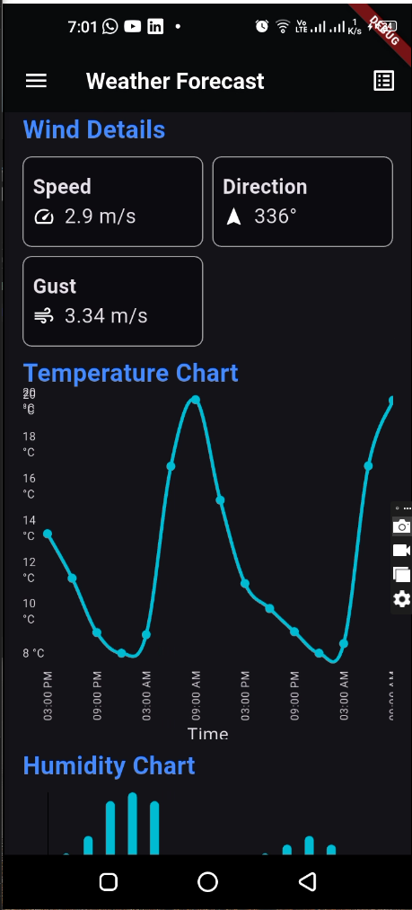
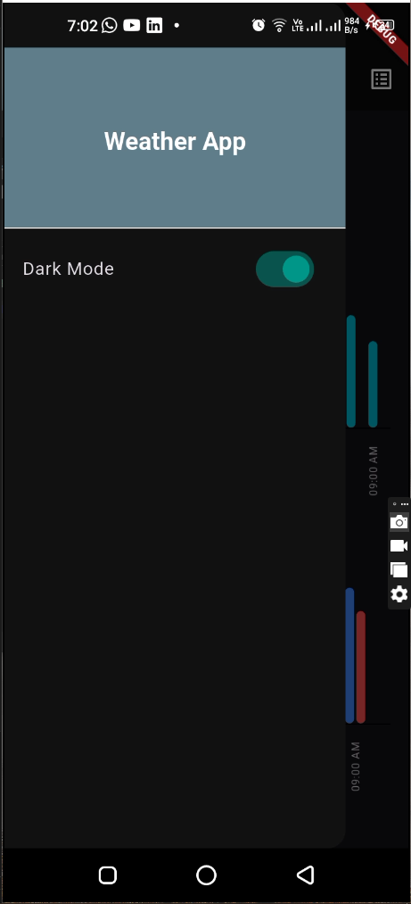
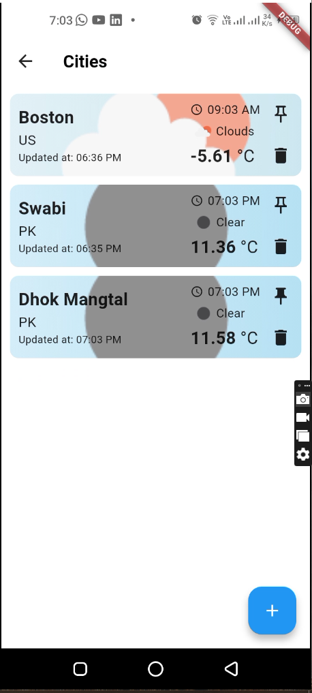

# Weather Forecast App 🌦️

A Flutter project that provides detailed weather forecasts for various cities. This app allows users to interact with weather data in a visually appealing and functional way, including charts and location-based weather updates.

## Features

- Add and remove cities from the list.
- View current weather details for each city (temperature, humidity, wind speed).
- Pin a city to the top of the list.
- Display temperature, humidity, and wind speed data using interactive charts.
- Toggle between light and dark themes for a personalized experience.
- Use geolocation to fetch weather data for the current location or search by city name.

---

## Built With

- **Flutter Version**: `3.27.1`
- **OpenWeatherMap API**: Provides weather data.
- **fl_chart**: Displays interactive charts and graphs.
- **geolocator**: Fetches the user’s current location.
- **provider**: Manages state in the app.
- **dio**: Makes network requests.
- **hive**: Stores data locally.

---

## Screenshots

> Dark Theme

    

> Light Theme



---

## Getting Started

Follow the steps below to set up and run this project on your local machine.

### Prerequisites

- Ensure Flutter SDK is installed. Follow the [Flutter installation guide](https://flutter.dev/docs/get-started/install).
- An OpenWeatherMap API key. Sign up at [OpenWeatherMap](https://openweathermap.org/api).

### Steps to Run

1. **Clone the repository**:

   ```bash
   git clone https://github.com/Munsif-Ali/weather_app
   cd weather_app
   ```

2. **Install dependencies**:

   ```bash
   flutter pub get
   ```

3. **Set up the OpenWeatherMap API key**:

   - Open the project folder.
   - create a new file named '.env' in the root directory.
   - Replace `<YOUR_API_KEY>` with your OpenWeatherMap API key:
     ```dart
     OPENWEATHER_API_KEY = "<YOUR_API_KEY>";
     ```

4. **Run the app**:

   - Connect a device or start an emulator.
   - Use the following command to run the app:
     ```bash
     flutter run
     ```

5. **Enjoy the app!**

---

## How It Works

### Adding a City

- Navigate to the Cities screen using the action button in the app bar.
- Tap on the floating action button to add a city.
- You can search for a city either by name or by using the geolocation feature.
  - **By Name**: Enter the city name.
  - **By Geolocation**: Enter Latitude and Longitude or click on the `Use Current Location` button to get current location coordinates.
- Tap on the `Add` button to add the city to the list.

### Viewing Charts

- Make the city pinned by tapping on the pin icon.
- The details of the pinned city will be displayed on the home screen with visual charts.

### Toggling Themes

- Access the drawer and switch between light and dark themes for a personalized look.

---

## Libraries Used

- **[fl_chart](https://pub.dev/packages/fl_chart)**: For rendering charts (temperature, humidity, wind speed).
- **[geolocator](https://pub.dev/packages/geolocator)**: For fetching the user's current location.
- **[provider](https://pub.dev/packages/provider)**: For state management.
- **[dio](https://pub.dev/packages/dio)**: For making network requests.
- **[hive](https://pub.dev/packages/hive)**: For local storage.

---

## Contact

For questions or feedback, please contact us at [munsifalitaj@gmail.com](mailto:munsifalitaj@gmail.com).
